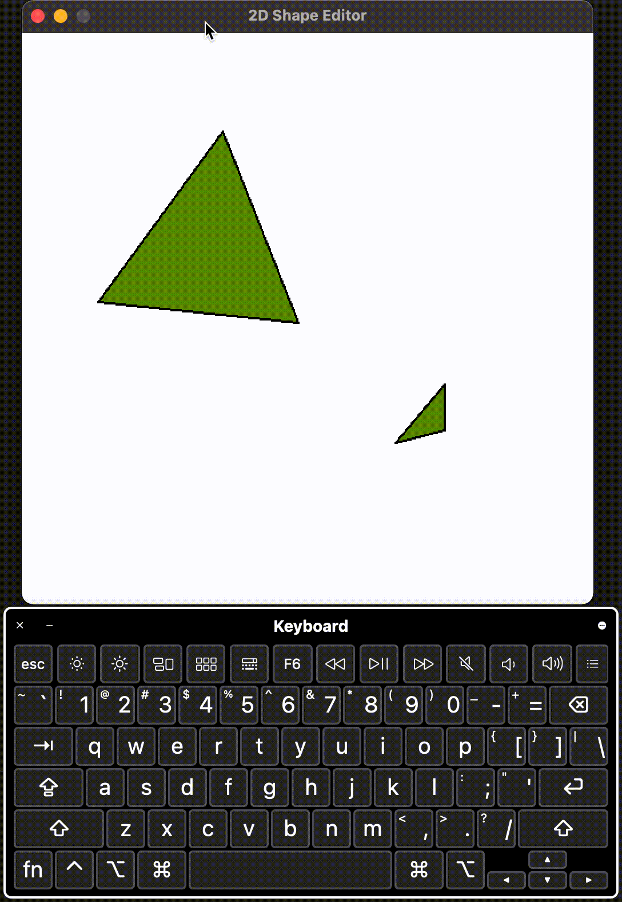
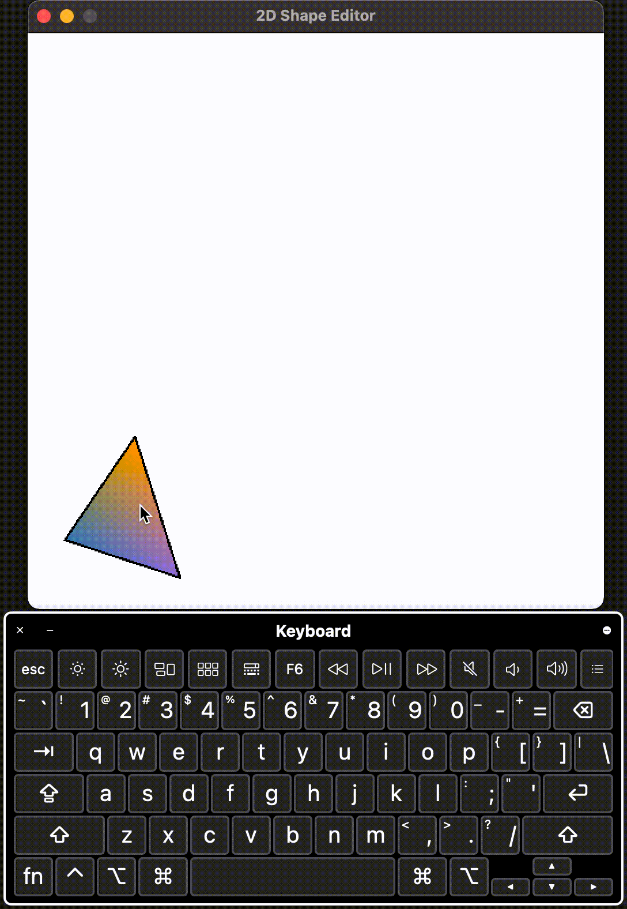

## Assignment 6

**Basic Information**

|          OS          |   Compiler   |
| :------------------: | :----------: |
| macOS Catalina 10.15 | Clang 12.0.0 |

### Ex.1 Triangle soup editor

I implemented the insertion, translation and deletion of triangles in this part. A demo is shown below (or see the video snippets in the `img` folder, since the gif images are not very smooth).

### Ex.2 & 4 Rotation/Scale

Since each triangle may have different behavior (translation, rotation, scaling) which is different from previous assignment where all triangles in the mesh move together, I associated each vertex with separate transformation matrices instead of using a unified one in `uniform`. Then in the vertex shader each vertex is processed by corresponding matrices. A demo is shown below.

### Ex.3 Colors

To select a vertex for changing color, I simply chose the one closest to mouse click position, but excluding the ones that are overlaid by other triangles. 

### Ex.5 View control

To achieve the view control effect, a matrix `view` is introduced in the `uniform` and applied to all vertices in the vertex shader.

### Ex.6 Keyframing

Linear interpolation and Bezier curves are used to do the animation of position. Press `F` to add a frame, press `X` to clear all currently stored frames, and press `M` to play using linear interpolation, press `B` for using Bezier curves.

 